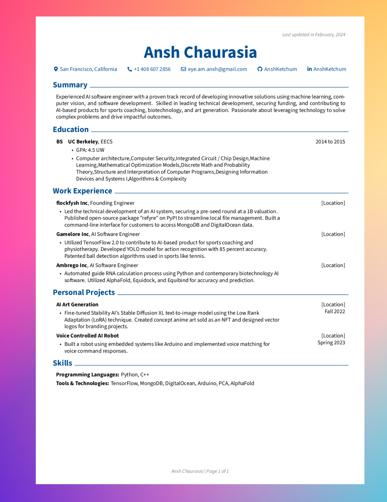

# Resume Optimizer


*Go the extra mile, without wasting thousands of hours. Achieve job market freedom using open source AI.*

An optimizer that takes a job description, a bank of experiences, and tailors your resume to the job description using AI. Check out an example pdf generated right [here](Ansh_Chaurasia_CV.pdf).

## Changelog
3/2/24
- Added support for AI generated cover letters! Looking for some feedback on what kind of edits you make post-generation.
- Progress on integrating in more in-depth web researchers for company recon
- Planning integrations for follow up messaging through LinkedIn and GMail  


## Features
- OpenAI compatible -- uses OpenAI's GPT models, but the backend can be swapped out
for an open source model with a couple minutes of effort.

## Setup
Tested with python 3.10 so far. Any version above 3.10 (11, 12) or 3.9 should work without much of a problem.

### Step 1: Repo
1. Clone the repository in whichever way you see fit.
2. `cd` into the base directory of the folder
3. Run `make install`, or the commands under the `install` section in Makefile to initialize
all the submodules.
4. Install the requirements. `pip install -r requirements.txt`

#### Step 2: Environment 

Visit openai's website, and [obtain an API key](https://www.youtube.com/watch?v=EQQjdwdVQ-M). Then, create an env file with the following content:
```bash
OPENAI_API_KEY="YOUR_API_KEY_HERE"
JOB_DESCRIPTION_FILEPATH="JOB_DESCRIPTION.txt"
JOB_COMPANY_NAME="COMPANY_NAME_HERE"
``` 

*What is an open source, OpenAI backend model?*
OpenAI's API has become a standard in the LLM world for scalably 
serving large language models. As OpenAI has grown, developers have created projects like [localai](asdfasfdhttps://github.com/mudler/LocalAI), enabling users to "mimic" OpenAI's API functionality, while using open source models.

**Open source, OpenAI models setup**: Add an extra line to your `.env` file. The entire file is shown below, for convenience.

```bash
OPENAI_API_KEY="YOUR_API_KEY_HERE"
JOB_DESCRIPTION_FILEPATH="JOB_DESCRIPTION.txt"
JOB_COMPANY_NAME="COMPANY_NAME_HERE"
OPENAI_CUSTOM_API="http://localhost:8080/v1/"
``` 
In this example, we assume that we use the v1 version of OpenAI's API, and that we are locally running it at port 8080 (works without change if you are using localai)

#### Step 3: Resume information
Edit `experiences.json` with your information.

That's it!

## Running the Program

#### Step 1: Loading the job description
Copy over your job description into `JOB_DESCRIPTION.txt`. If `JOB_DESCRIPTION_FILEPATH` isn't set in `.env`, make sure to point that variable to the filepath of `JOB_DESCRIPTION.txt`

#### Step 2: Running the Program
Run the program with `python main.py`. You will see the `output` folder become populated with various file, and a single `.pdf` file containing your resume.

### Making Edits to your Resume
1. Open up `resume_int.json` (the intermediate resume), and make the modifications you'd like to make.
2. Regenerate the resume with `rendercv render resume_int.json` or, more conveniently `make edit`

### Making Edits to your Cover Letter
Make sure you run the entire workflow once before attempting to edit the cover letter.

1. Open up the `cover_letters` folder. This will contain all of the information that is used to craft a crisp letter.
2. Edit `info.json` with the proper company details
3. Regenerate the resume with `make edit-cover`

### Common Errors
```
    p["highlights"] = [sanitize_for_latex(p["description"])]
KeyError: 'description'
```
Re-run the script, it sometimes happens.

### Achieving a ZERO-COST run. 
The key here is that we will use the existing ChatGPT interface (chat.openai.com) for small scale resumes. It has been tested with 2-3 pages, should work with most resumes unless you've written a literal book. To activate this mode, switch the line 

```
llm = OpenAIBackendAPI()
```
to 
```
llm = OpenAIChatAPI()
```
You will be prompted to log into ChatGPT. Log in on the window that pops up (the AI can't access your credentials in any way, it'll start it's interactions after you log in), and type 'y' in the interface after doing so. Enjoy being able to use the latest and sweetest AI models for completely free!
### Miscellaneous
Added a `Makefile` for misc operations, like cleanup. To clean up old files, run `make clean`.

## TODO:
1. Add additional support, create more documented pathways for running the entire workflow open source!
2. Add in support for researching, and gathering relevant context / attempting to reasonably infer info about what the company may be delving into to provide extra tailoring information.

## Future
1. Support for LinkedIn / Gmail outreach with resumes
